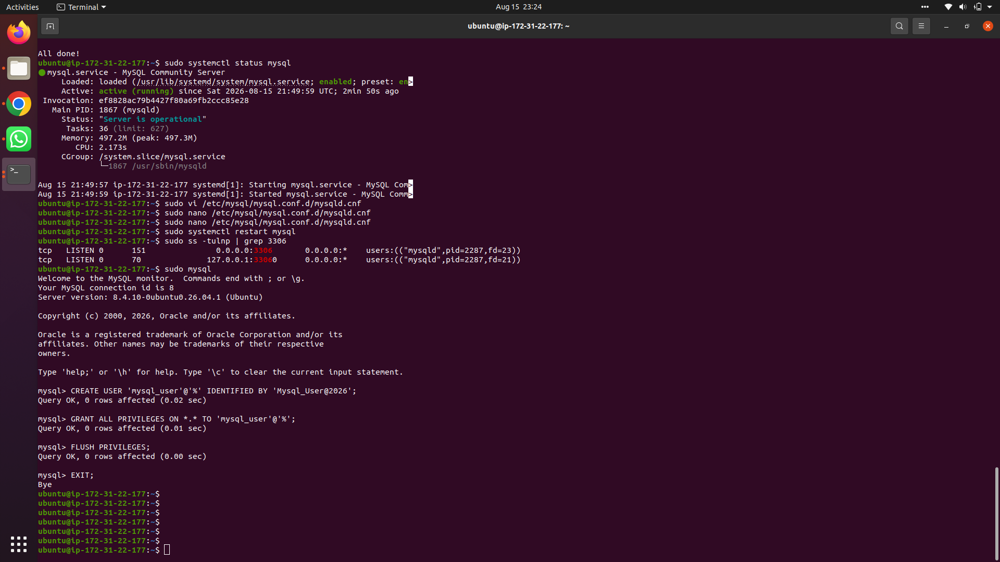
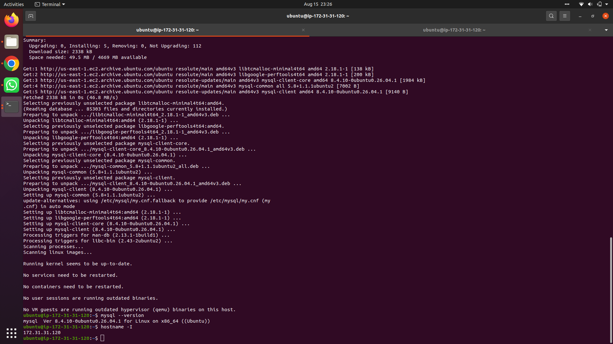
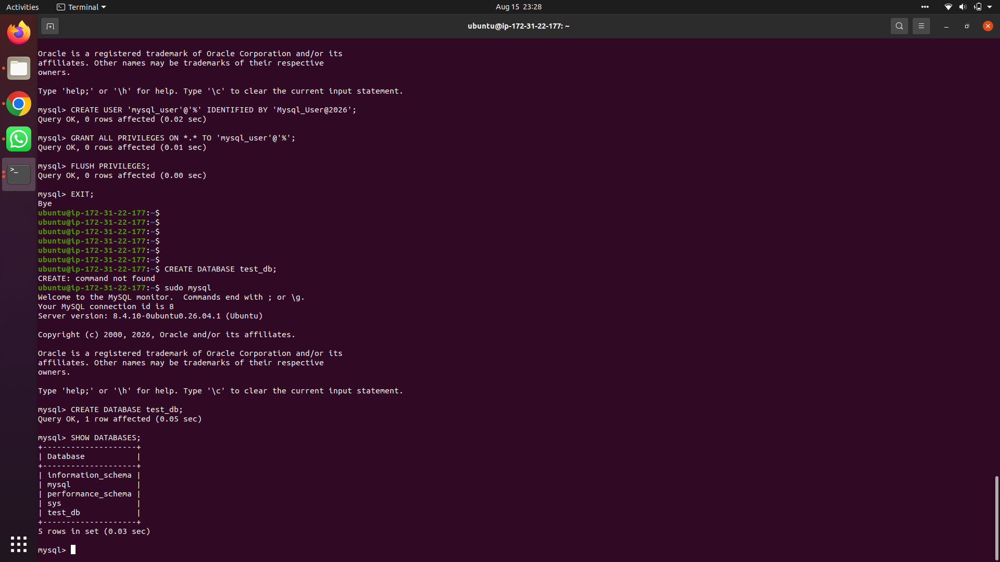
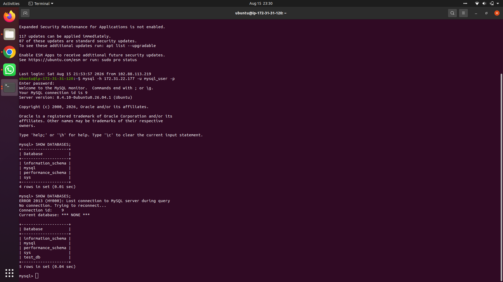
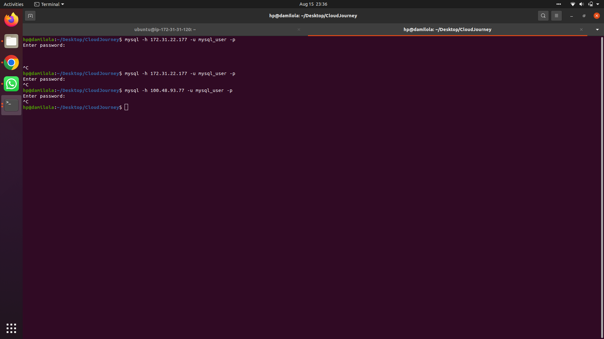

# Client-Server Architecture with MySQL

## Overview

This project demonstrates a basic **Client-Server architecture** using the MySQL Database Management System (DBMS). Two separate Linux-based EC2 instances were provisioned in AWS:

- **`mysql server`** — hosts the MySQL Server software (the "Server")
- **`mysql client`** — hosts only the MySQL Client software and connects remotely (the "Client")

The two instances communicate over a **local network** (private IP addresses within the same VPC) via TCP port `3306`, with access restricted at the network level using AWS Security Groups.

---

## Steps

### 1. Launch two EC2 instances

Two Ubuntu EC2 instances were created in the same VPC/subnet:

| Instance | Role |
|---|---|
| `mysql server` | Hosts the MySQL Server |
| `mysql client` | Connects remotely as the Client |

---

### 2. Install MySQL Server on `mysql server`

```bash
sudo apt update
sudo apt install mysql-server -y
sudo systemctl start mysql
sudo systemctl enable mysql
sudo mysql_secure_installation
```

Confirmed the service was active and running:



---

### 3. Install MySQL Client on `mysql client`

```bash
sudo apt update
sudo apt install mysql-client -y
mysql --version
```

Verified the client installed successfully and retrieved the instance's private IP for use in later steps:



---

### 4. Open port 3306 in `mysql server`'s Security Group

An inbound rule was added to the `mysql server` Security Group:

- **Type:** MYSQL/Aurora
- **Port:** 3306
- **Source:** the private IP of `mysql client` only (`/32`), not open to the world

This ensures only the designated client instance can reach the database server.

---

### 5. Configure MySQL to allow remote connections

On `mysql server`, the bind address was updated:

```bash
sudo vi /etc/mysql/mysql.conf.d/mysqld.cnf
```

Changed:
```
bind-address = 127.0.0.1
```
to:
```
bind-address = 0.0.0.0
```

Then restarted the service and confirmed it was listening on all interfaces:

```bash
sudo systemctl restart mysql
sudo ss -tulnp | grep 3306
```

```
tcp   LISTEN 0   151   0.0.0.0:3306   0.0.0.0:*   users:(("mysqld",pid=2287,fd=23))
```

---

### 6. Create a remote-access MySQL user

On `mysql server`:

```sql
CREATE USER 'mysql_user'@'%' IDENTIFIED BY 'Mysql_User@2026';
GRANT ALL PRIVILEGES ON *.* TO 'mysql_user'@'%';
FLUSH PRIVILEGES;
```

A test database was also created here to verify replication of data to the client later:

```sql
CREATE DATABASE test_db;
SHOW DATABASES;
```



---

### 7. Connect remotely from `mysql client`

From the `mysql client` instance, a direct connection was made to the server's private IP — no SSH tunnel involved:

```bash
mysql -h <mysql-server-private-ip> -u mysql_user -p
```

---

### 8. Verify the connection and data visibility

Once connected, `SHOW DATABASES;` was run on the client and confirmed `test_db` (created on the server) was visible remotely — proving the client reads live from the server:

```sql
SHOW DATABASES;
```



---

### 9. Confirm the Security Group blocks unauthorized access

To validate the network-level restriction, a connection attempt was made from an **unauthorized** local machine (outside the whitelisted client IP), using both the server's private and public IPs:

```bash
mysql -h <mysql-server-ip> -u mysql_user -p
```

The connection hung indefinitely with no response, confirming the request was silently dropped by the Security Group rather than reaching MySQL at all:



---

## Result

The project successfully demonstrates a fully functional MySQL Client-Server setup:

- ✅ MySQL Server installed and running on a dedicated EC2 instance
- ✅ MySQL Client installed on a separate EC2 instance
- ✅ Remote connectivity configured (`bind-address`, remote user, port 3306)
- ✅ Network access restricted via Security Group to a single authorized IP
- ✅ Data created on the server was successfully queried from the client
- ✅ Unauthorized access from an untrusted IP was confirmed blocked
